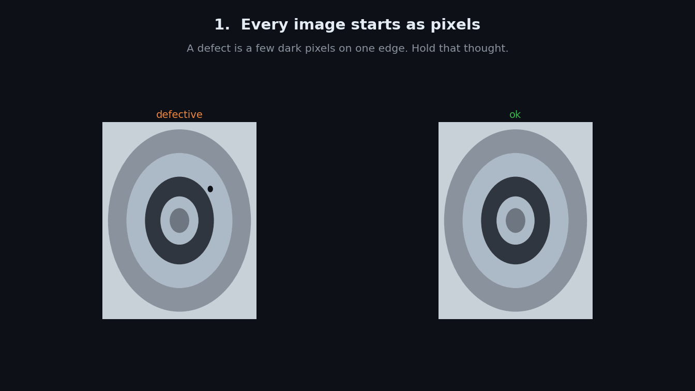

# Casting defect classification

An application on top of `vision-serve` that classifies photographs of cast
metal parts as defective or OK. It exists to exercise the platform on a real
industrial inspection task, end to end, from raw data to a served model.

**Status: M1, data foundations, in progress.** No model has been trained yet.
This document currently covers the dataset and the data-cleaning work. The
training, evaluation, and serving sections will be added as those milestones
land.

## The dataset

A public dataset of submersible pump impeller images from a real production
line, each labelled `def_front` (defective) or `ok_front`. Every image was
captured under the same fixed camera and lighting, so the parts vary but the
framing does not.

The download ships in two forms:

- a pre-split set of 7,348 images at 300 by 300, already divided into train
  and test
- an unsplit set of 1,300 originals at 512 by 512

We build everything from the 1,300 originals. The reasoning is in the next
section.

## Why we rebuild the split

7,348 images cannot come from 1,300 by downscaling, so the larger set is the
originals plus augmented copies: rotated, flipped, or otherwise transformed
versions of the same physical parts. Whether that augmentation ran before or
after the shipped train and test split is undocumented, which means
transformed copies of one casting may sit on both sides of that split.

A model tested against transformed copies of its own training images reports
an accuracy that measures memory, not learning. To avoid that, we discard the
shipped split entirely and build our own from the 1,300 originals: split
first, with a fixed random seed and stratified by label, then augment the
training portion only, and only after the split exists.

One limitation we state rather than hide: the filenames carry no part
identifier, so two separate photographs of the same physical impeller cannot
be detected, and may still land on opposite sides of the split.

## Deduplication: an investigation, and a negative result

Before splitting, we checked the 1,300 originals for duplicates. If the same
image appears in both train and test, the same memory problem returns. We used
two kinds of hash, a hash being a short code computed from an image that lets
two images be compared without comparing every pixel.



**Cryptographic hash (SHA-256).** A code that changes completely if even one
byte of the file changes. It catches perfect, byte-for-byte copies. It found
none.

**Perceptual hash (dHash).** Each image is shrunk to an 8 by 8 grid, 64 pixels
in all, and the pattern of which pixels are brighter than their neighbours
becomes a 64-bit fingerprint. Two fingerprints are compared by the Hamming
distance: the count of bits that differ. A small distance means the images
look near-identical, which is the standard way to catch the same photo resized
or re-saved.

Rather than guess a distance threshold, we measured the distances across all
pairs and looked at the distribution. There was no separate cluster of
near-duplicates: one smooth spread, with the closest pairs turning out to be
genuinely different parts.

The reason is structural, and it is the point of the whole exercise. A defect
on these parts is a few dark pixels on one edge. Shrinking the image to 64
pixels erases it, so a defective part and a good part can carry almost the same
fingerprint. Perceptual hashing is blind to the exact feature the dataset
exists to detect, so it is the wrong tool for deduplicating this data, and we
do not use it to remove anything here.

## What this leaves us with

We delete nothing. The raw images stay immutable, the exact-copy check stays in
the pipeline, and every decision about an image is recorded in a text manifest
rather than by copying files into folders. A manifest is a decision you can
read in a diff and undo later, which a rearranged folder tree is not.

## Running the deduplication check on your own data

The perceptual check does not run as part of the automated pipeline, by
design. If it did, it would mark genuinely different parts as duplicates on
data like this and quietly corrupt the split. Instead the pipeline only ever
does the safe, exact SHA-256 check, and the perceptual analysis is a separate
step you run deliberately when you want it.

If you bring your own dataset to this app, this is how to decide whether
perceptual deduplication is safe for it.

**Step 1: build the manifest.** This scans your images, verifies each one is
readable, and records both hashes. It removes nothing.

```
uv run python src/vision_serve/apps/casting/prepare_data.py
```

**Step 2: run the perceptual analysis.** This reads the images, measures the
Hamming distance between every pair, and prints the distribution. It writes
nothing and changes nothing.

```
uv run python src/vision_serve/apps/casting/explore_phash.py
```

**Step 3: read the shape of the distribution.** This is the decision, and it
depends on your data, not on a number copied from somewhere else.

- A separate cluster of pairs at very small distances, sitting apart from the
  main spread with a visible gap, means real near-duplicates are present. The
  gap is your threshold: pairs below it are worth inspecting and removing.
- One smooth spread with no separate near-zero cluster, which is what this
  casting dataset produces, means there are no true near-duplicates to remove.
  Imposing a threshold anyway would flag different parts that merely look
  alike, which is worse than doing nothing.

The rule behind both cases: measure your own distribution before choosing a
threshold, and never carry a threshold over from another dataset. On
fine-grained inspection data, where the thing you care about is a small local
detail, expect perceptual hashing to be blind to it and check before you act.

## Contents

- `prepare_data.py`: scans the raw images, verifies each one is readable,
  records its facts including both hashes, and writes the manifest. Removes
  nothing.
- `explore_phash.py`: the opt-in perceptual-hash analysis described above,
  and the source of the deduplication finding
- `manifests/`: the committed manifest files
- `DATASET.md`: dataset provenance and known limitations, to follow

## Coming next

- the manifest schema and the stratified split
- augmentation of the training split
- a baseline model, then evaluation against it
- serving the trained model as a `vision-serve` app
